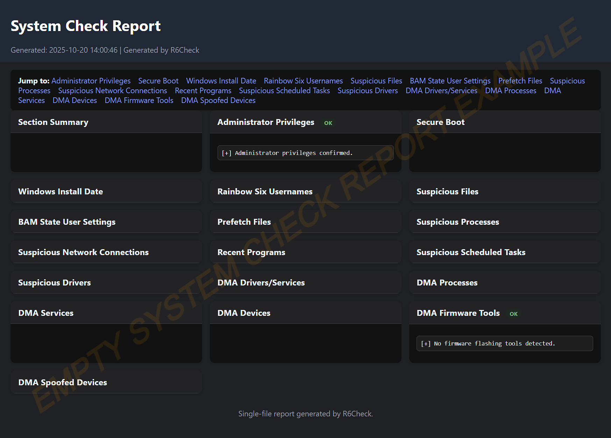

# R6Check — Rainbow Six Siege PC Scanner

An advanced PowerShell-based scanner that surfaces DMA hardware, cheats, and risky system indicators on Windows. It’s detection‑only and writes a single, anonymized HTML report to your Desktop.

[](LICENSE)
[](https://learn.microsoft.com/powershell/)
[](https://www.microsoft.com/windows)

## Screenshot


## Overview

R6Check focuses on Rainbow Six Siege environments. It checks for DMA devices and tooling, suspicious processes and network connections, persistence mechanisms, and other signals commonly associated with cheating or tampering. The script never quarantines or removes anything.

- Detection‑only: never deletes, blocks, or quarantines.
- Local‑first: no external connections by default.
- Privacy‑minded: report is anonymized and saved only on your Desktop.


## Features

- DMA detection suite
  - PCIe/USB devices (kmBoxNet, PCILeech, Screamer, etc.)
  - Related drivers and services
  - Running processes and common firmware flashing utilities
  - Spoofed device names/IDs
- Process and file signals
  - Cheat/injector patterns in process names and paths
  - Common red‑team tools
  - Suspicious files in common user locations
- Network indicators
  - Established TCP connections with port context and process mapping
  - Highlights suspicious remotes and tooling‑like behavior
- System/persistence checks
  - Secure Boot status
  - Windows install date
  - BAM State User Settings and Prefetch entries (execution hints)
  - Recently installed programs
  - Suspicious scheduled tasks
  - Suspicious drivers by name/display patterns
- R6‑specific artifacts
  - Enumerates Rainbow Six Siege usernames from save paths
- Unified report and scoring
  - Single HTML with per‑section findings and a lightweight risk summary

## How To Use R6Check 

### *Simple 3-Step Process:*

1. **Download**
   - Go to your GitHub: `https://github.com/dyvertigo/R6Check`
   - Click the green "Code" button → "Download ZIP"


2. **Extract & Run**
   - Extract the ZIP file to a folder (e.g., `C:\Tools\R6Check\`)
   - Right-click `R6Check.ps1` → **Run with PowerShell**
   - OR open PowerShell in that folder and type: `.\R6Check.ps1`

3. **View Report**
   - Script runs automatically (requests admin if needed)
   - HTML report appears on their Desktop: `C:\Users\[Your Username]\Desktop`
   - Opens in browser to see results


### *Want Discord Upload? (Optional)*

-  Discord webhook *(⚠️ DO NOT SHARE YOUR WEBHOOK WITH OTHERS! ⚠️)*

```powershell
.\R6Check.ps1 -WebhookUrl "https://discord.com/api/webhooks/..."
```

- Obfuscated Base64 webhook (decoded in memory): 

see `docs/OBFUSCATED-WEBHOOK-GUIDE.md` for the walkthrough.


Notes:
- Webhook usage is optional and intended for trusted scenarios only.
- Uploads are disabled unless you pass a webhook at runtime.

## Output

- One HTML file on your Desktop: `SystemCheckReport.html`.
- The report header avoids including your Windows username/computer name.
- No separate text logs are produced by default.

## FAQ

- Is this an anti‑cheat? No—R6Check is a diagnostic scanner that highlights suspicious signals; it doesn’t enforce or ban.
- Can it remove cheats? No—it’s detection‑only and doesn’t remediate.
- Will it expose my identity? By default, nothing is uploaded and the HTML report is anonymized.

## License

MIT License — see [LICENSE](LICENSE).


## Support

- Issues: https://github.com/dyvertigo/R6Check/issues
- Discussions: https://github.com/dyvertigo/R6Check/discussions

## Disclaimer

Use only on systems you own or are authorized to audit. No warranty is provided. The authors aren’t responsible for misuse.

Made for the Rainbow Six Siege community.